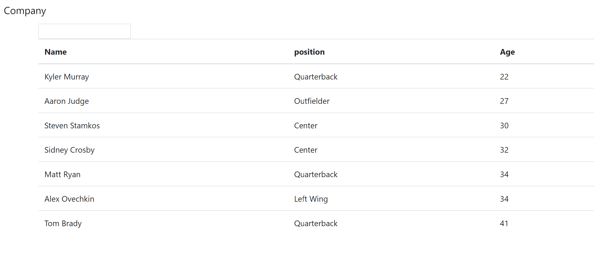
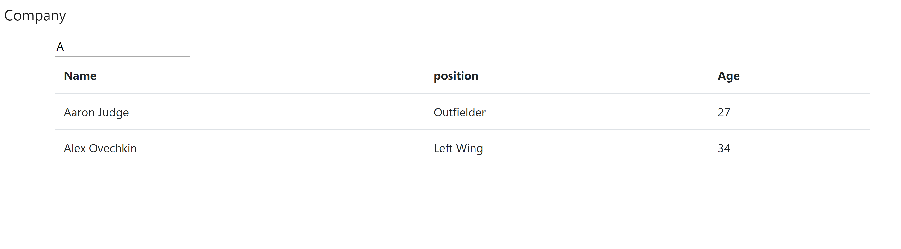

# Employee Directory - HW 19
https://github.com/stevenrsewell/Employee-Directory
https://employee-directory-srs.herokuapp.com/

This application is a react based employee directory application that will render a table of users from a data file. The application is run with the command:

`npm start`

## Dependencies Used
<ol>
<li>React</li>
<li>Javascript</li>
</ol>

## User Story
As A user ... I WANT to be able to view my entire employee directory at once ... SO THAT I have quick access to their information.

## Screenshots

